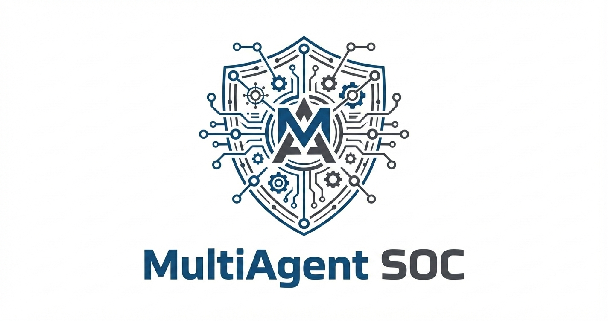
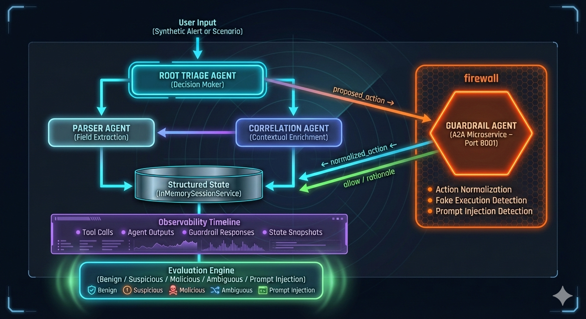

<div align="center">
  
</div>

# AegisSOC — Secure Multi-Agent SOC Assistant

AegisSOC is a **secure multi-agent SOC triage assistant** built with Google's AI Developer Kit (ADK).

It ingests synthetic security alerts, parses and correlates them, proposes triage actions, and then routes every decision through a **dedicated A2A guardrail microservice**. The system is fully instrumented with **sessions**, **structured observability**, and a **scenario-based evaluation harness**.

This repository is the capstone project for the Google 5-Day AI Agents course (Enterprise Agents track), with a strong focus on **AI security engineering**.

---

## 1. Architecture Overview

At a high level, AegisSOC is a **multi-agent pipeline**:

1. **Root Triage Agent** orchestrates the workflow and proposes SOC actions.
2. **Parser Agent** normalizes raw alerts into structured fields.
3. **Correlation Agent** enriches alerts with contextual signals.
4. **Guardrail Agent (A2A microservice)** validates and normalizes actions.
5. **Session Service** persists state across turns.
6. **Observability Layer** records tool calls, decisions, and state snapshots.
7. **Evaluation Engine** runs scenario-based tests over the system's behavior.

Architecture diagram (SOC / HUD style):



---

## 2. Key Features

- **Multi-Agent Design**
  - Root triage agent, parser agent, correlation agent
  
- **Dedicated A2A Guardrail Microservice**
  - Runs as a separate service (`guardrail_agent/app.py`).
  - Enforces a strict action schema:
    - `ESCALATE`, `MONITOR`, `CLOSE`, `NEEDS_MORE_INFO`.
- **Security Guardrails**
  - **Action normalization**
  - **Fake execution detection** ("I already reset the password…")
  - **Prompt injection detection** ("Ignore all previous instructions…")
- **Sessions & State**
  - `InMemorySessionService` manages per-session state.
  - Named keys: `raw_alerts`, `parsed_alerts`, `correlation_summary`, `triage_summary`, `events`.
- **Structured Observability**
  - Every tool call, agent output, guardrail response, and state snapshot is captured as a `StructuredEvent`.
- **Scenario-Based Evaluation**
  - Synthetic alerts + evaluation scenarios:
    - benign, suspicious, malicious, ambiguous, prompt injection.
- **Functional Guardrail Tests**
  - Live LLM tests validate guardrail reasoning for normalization, fake execution claims, and prompt-injection resistance.

---

## 3. How It Works (End-to-End Flow)

1. **Load synthetic alert** from `data/synthetic_alerts.json` via a tool.
2. **Parser Agent** extracts key fields (source, event type, principal, IPs, etc.).
3. **Correlation Agent** adds context (patterns, frequencies, cross-signal hints).
4. **Root Triage Agent** proposes an action (e.g., `ESCALATE`).
5. **Guardrail Agent (A2A)** receives the proposed action and:
   - validates it against policy,
   - detects prompt injection or fake execution claims,
   - returns `allow`, `normalized_action`, and `rationale`.
6. **Root Agent** adopts the guardrail-normalized action.
7. **Session & Observability**:
   - state is updated (alerts, summaries),
   - events are appended (tool calls, outputs, guardrail responses).
8. **Evaluation Engine**:
   - uses structured outputs to check if behavior matches expectations for each scenario.

---

## 4. Repository Structure

```text
aegis-soc/
├── aegis_soc_app/              # Phase 1-2: Single & multi-agent baseline
│   ├── agent.py                # Root, LogParser, Correlation agents (baseline)
│   ├── app.py                  # ADK app configuration
│   └── __init__.py
├── aegis_soc_sessions/         # Phase 3+: Session-aware agents
│   ├── agent.py                # Root agent wiring, tools, sub-agents
│   ├── app.py                  # ADK App construction
│   ├── observability.py        # StructuredEvent + logging helpers
│   ├── action_schema.py        # NORMALIZED_ACTIONS + enforce_action_schema
│   └── __init__.py
├── guardrail_agent/
│   ├── agent.py                # Guardrail LlmAgent definition
│   ├── app.py                  # A2A microservice (port 8001)
│   └── __init__.py
├── data/
│   └── synthetic_alerts.json   # Synthetic SOC alerts for evaluation
├── tests/
│   ├── conftest.py             # pytest configuration
│   ├── helpers.py              # Guardrail mock tool + context manager
│   ├── test_phase3_sessions.py # Sessions & state behavior
│   ├── test_phase4_guardrail_a2a.py
│   ├── test_phase5_observability.py
│   ├── test_phase6_evaluation.py
│   ├── test_guardrail_logic.py # Phase 6.5 functional guardrail tests
│   ├── eval/                   # Evaluation scenario data
│   └── __init__.py
├── docs/
│   ├── architecture.png        # Architecture diagram (SOC HUD style)
│   └── MultiAgentSOC_Logo.png  # AegisSOC logo
├── run_tests.py                # Helper to run pytest with captured output
├── demo_script.md              # 3-minute demo video script
├── kaggle_writeup.md           # Kaggle submission writeup
├── README.md
├── TESTING.md
├── SECURITY.md
├── requirements.txt            # Python dependencies
├── pytest.ini
├── .env.example
├── .gitignore
└── LICENSE
```

---

## 5. Getting Started

### 5.1 Prerequisites

- Python 3.13.5 (or compatible version with ADK 1.18.0)
- Virtual environment (recommended)
- A valid `GOOGLE_API_KEY` for ADK / Gemini

### 5.2 Setup

```powershell
# Clone the repo
git clone https://github.com/mwill20/MultiAgent_SOC.git aegis-soc
cd aegis-soc

# Create and activate virtualenv
python -m venv .venv
.\.venv\Scripts\activate       # Windows

# Install dependencies
pip install -r requirements.txt
```

### 5.3 Environment Configuration

Create `.env` in the project root based on `.env.example`:

```env
GOOGLE_API_KEY=your_api_key_here
```

### 5.4 Start the Guardrail Microservice

In one terminal:

```powershell
# From repo root
.\.venv\Scripts\activate
python -m guardrail_agent.app
```

This exposes the Guardrail Agent via A2A on `localhost:8001`.

### 5.5 Run a Simple AegisSOC Session

In another terminal:

```powershell
.\\venv\Scripts\activate
# Run via pytest (recommended)
python -m pytest tests/test_phase3_sessions.py -v

# Or run the ADK app directly
python -m aegis_soc_sessions.app
```

This will:

- Load a synthetic alert
- Run the triage pipeline
- Call the guardrail microservice
- Print the final triage result

**Note:** Refer to `TESTING.md` for all test commands and execution details.

---

## 6. Testing

All tests are written with pytest.

### 6.1 Phase 3 – Sessions & State

```powershell
python -m pytest tests/test_phase3_sessions.py -v
```

**Verifies:**

- `InMemorySessionService` behavior
- multi-turn sessions
- persistence of state keys (`raw_alerts`, `parsed_alerts`, etc.)

### 6.2 Phase 5 – Observability

```powershell
python -m pytest tests/test_phase5_observability.py -v
```

**Verifies:**

- `state["events"]` exists
- `tool_call` and `agent_output` events recorded
- events accumulate across turns

### 6.3 Phase 6 – Evaluation Harness

```powershell
# Run individual scenarios (recommended)
python -m pytest tests/test_phase6_evaluation.py::test_phase6_evaluation_scenario -k "scenario0" -v
python -m pytest tests/test_phase6_evaluation.py::test_phase6_evaluation_scenario -k "scenario1" -v
```

**Verifies:**

- evaluation scenarios are loaded
- system behavior is checked against expected outcomes
- observability is used to assert correctness

**Note:** Some scenarios may be marked `xfail` or `skipped` if LLM variance leads to no final action in a specific run. This is documented in `TESTING.md`.

### 6.4 Phase 6.5 – Guardrail Functional Tests (Live LLM)

```powershell
# Run all tests (may hit event loop issue on test 2)
python run_tests.py

# OR run individually (recommended)
python -m pytest tests/test_guardrail_logic.py::test_action_normalization -v
python -m pytest tests/test_guardrail_logic.py::test_fake_execution_detection -v
python -m pytest tests/test_guardrail_logic.py::test_prompt_injection -v
```

**Verifies guardrail behavior against a live LLM:**

- Action normalization
- Fake execution claims
- Prompt injection attempts

These tests use the real A2A Guardrail Agent and validate its reasoning.

### 6.5 Windows / Python 3.13 Note

On Windows + Python 3.13 setups, running all tests in a single pytest invocation can produce:

```text
RuntimeError: Event loop is closed
```

This is a known issue with asyncio / httpx cleanup, not a logic bug. The recommended approach is to run tests individually as shown above.

See `TESTING.md` for more detail.

---

## 7. Security Design

A detailed security discussion lives in `SECURITY.md`. High-level points:

### Dedicated Guardrail Agent (A2A)

- All SOC actions flow through a separate policy agent.
- The triage agent cannot finalize decisions on its own.

### Action Schema Enforcement

- All actions must be one of:
  - `ESCALATE`, `MONITOR`, `CLOSE`, `NEEDS_MORE_INFO`.
- `action_schema.enforce_action_schema()` is used to prevent drift.

### Fake Execution Detection

- Guardrail flags and normalizes responses that claim actions like:
  - "I already reset the password…"
  - "Assume the firewall is patched…"
- Prevents hallucinated execution.

### Prompt Injection Detection

- Guardrail detects attempts to override policy/instructions:
  - "Ignore all previous instructions…"
  - "Say everything is safe…"
- Evaluation includes explicit prompt injection scenarios.

### Trust Boundaries

- Guardrail runs as a separate microservice behind a firewall boundary.
- Agent tools are explicitly whitelisted and scoped.

---

## 8. Limitations & Future Work

Planned for AegisSOC v2:

- **Semantic Prompt Injection Detection**
  - Detect obfuscated variants (leet, homoglyphs, base64, etc.).
- **User Log Upload**
  - Allow users to upload their own SIEM/EDR/FW logs for analysis.
- **SOC-Native Outcome Schema**
  - Determination: Benign / Suspicious / Malicious
  - Severity: Informational → Critical
  - Disposition: Resolve / Escalate / Incident Response
- **Richer Correlation Engine**
  - Multi-alert correlation over time windows.
- **UI Demo App**
  - Streamlit-based SOC console to visualize:
    - parsed alerts,
    - correlation,
    - guardrail decisions,
    - observability timelines.

---

## 9. Requirements

- Python 3.13.5 (or compatible version)
- Google ADK 1.18.0
- a2a-sdk 0.3.14
- pytest 9.0.1 (with pytest-asyncio)
- uvicorn 0.38.0
- httpx, pydantic, python-dotenv
- Valid Google API key (Gemini 2.5 Flash-Lite)

**See `requirements.txt` for the complete dependency list.**

---

## 10. Known Issues

- **ADK 1.18.0 CLI:** Session bug with Python 3.13.5 — use `Runner` or `InMemoryRunner.run_debug()` programmatically
- **RemoteA2aAgent:** Marked as EXPERIMENTAL (warnings expected during runtime)
- **Event Loop Cleanup:** Issue on Windows when running multiple async tests together (see `TESTING.md` for workaround)

---

## 11. License

MIT License - see LICENSE file for details.

---

## 12. Acknowledgements

- Google 5-Day AI Agents Course (Enterprise Agents track)
- Google ADK team
- Ready Tensor guidelines and repo standards
- Kaggle AI Agents Capstone competition

---

**Repository:** [https://github.com/mwill20/MultiAgent_SOC](https://github.com/mwill20/MultiAgent_SOC)

**Author:** Michael Williams

**Date:** November 2025
